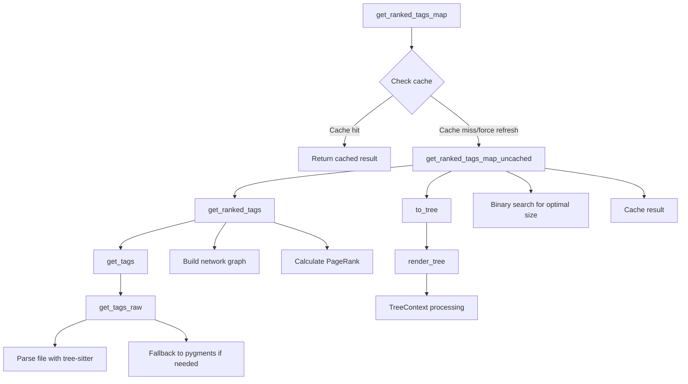
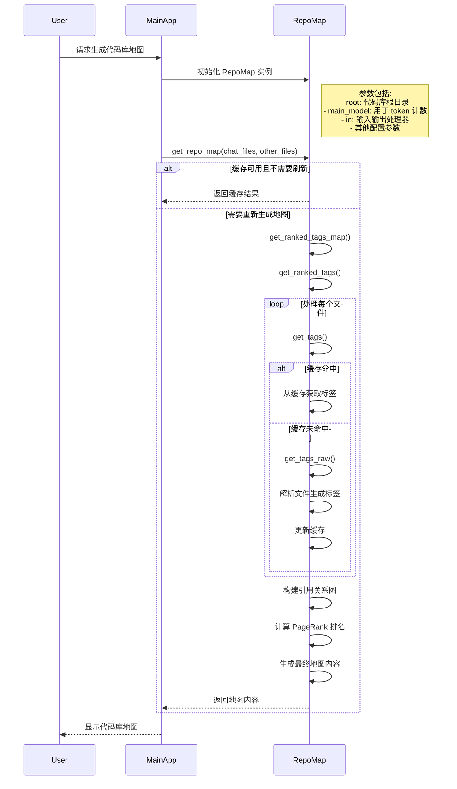
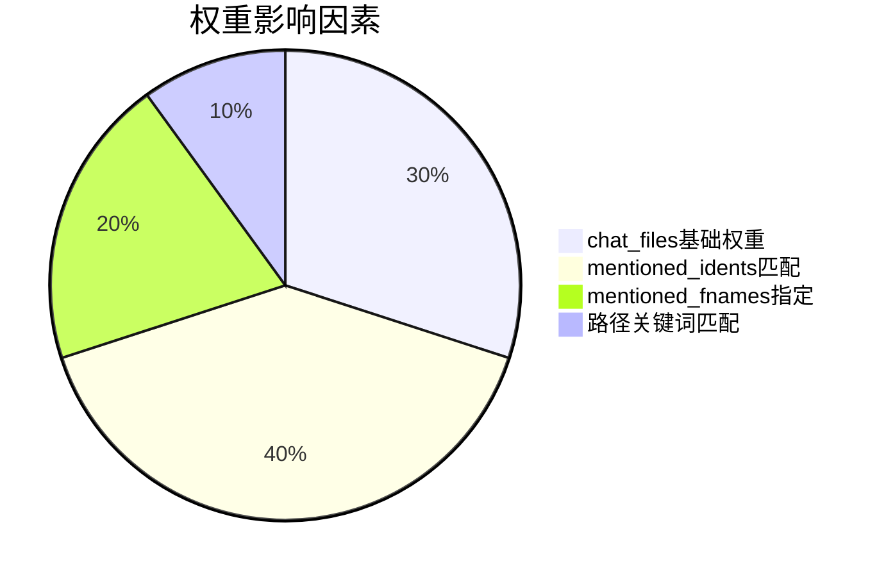

## `defines`, `references` 和 `definitions` 数据结构示例

### 1. `defines` 示例
`defines` 是一个 `defaultdict(set)`，记录每个符号在哪些文件中被定义。

```python
{
    "calculate_total": {"src/utils/math.py", "src/calculator.py"},
    "User": {"src/models/user.py"},
    "config": {"src/config.py", "tests/mocks/config_mock.py"},
    "_internal_check": {"src/utils/validation.py"}
}
```

- **键**: 符号名称(如函数名、类名等)
- **值**: 包含该符号定义的文件路径集合
- **特点**: 一个符号可能在多个文件中定义(如重载函数)

### 2. `references` 示例
`references` 是一个 `defaultdict(list)`，记录每个符号在哪些文件中被引用。

```python
{
    "calculate_total": [
        "src/checkout.py",
        "src/checkout.py",  # 可能多次引用
        "tests/test_calculations.py",
        "src/reports/generator.py"
    ],
    "User": [
        "src/controllers/auth.py",
        "src/api/serializers.py"
    ],
    "config": [
        "src/main.py",
        "src/utils/logger.py",
        "src/main.py"  # 重复引用
    ]
}
```

- **键**: 被引用的符号名称
- **值**: 引用该符号的文件路径列表(保留重复引用)
- **特点**: 引用次数可以通过统计列表中元素出现次数得到

### 3. `definitions` 示例
`definitions` 是一个 `defaultdict(set)`，记录每个(文件, 符号)组合对应的具体Tag对象。

```python
{
    ("src/utils/math.py", "calculate_total"): {
        <Tag object: name='calculate_total', kind='def', line=42>,
        <Tag object: name='calculate_total', kind='def', line=78>  # 可能重载
    },
    ("src/models/user.py", "User"): {
        <Tag object: name='User', kind='def', line=10>
    },
    ("src/utils/validation.py", "_internal_check"): {
        <Tag object: name='_internal_check', kind='def', line=135>
    }
}
```

- **键**: 元组 `(文件路径, 符号名)`
- **值**: 该位置定义的所有Tag对象集合
- **Tag对象内容**:
  - `name`: 符号名称
  - `kind`: 类型('def'表示定义)
  - `line`: 定义所在行号
  - 可能包含其他元数据(如作用域、返回类型等)

### 三者的关系示例

假设有以下代码文件：

**src/utils/math.py**
```python
def calculate_total(items):  # 定义1
    return sum(items)

def calculate_total(items, discount):  # 定义2 (重载)
    return sum(items) * (1 - discount)
```

**src/checkout.py**
```python
from .utils.math import calculate_total

total = calculate_total(cart_items)  # 引用1
discounted = calculate_total(cart_items, 0.1)  # 引用2
```

对应的数据结构将是：

```python
defines = {
    "calculate_total": {"src/utils/math.py"}
}

references = {
    "calculate_total": [
        "src/checkout.py",
        "src/checkout.py"
    ]
}

definitions = {
    ("src/utils/math.py", "calculate_total"): {
        <Tag name='calculate_total' kind='def' line=1>,
        <Tag name='calculate_total' kind='def' line=4>
    }
}
```

--- 

基于 [get_ranked_tags](file://c:\Users\phx10\code\aider\aider\repomap.py#L346-L574) 的实现，图中每条边的权重计算公式如下：

## 边权重计算公式

对于从文件 `referencer` 到文件 `definer` 的边，权重计算公式为：

```
edge_weight = use_mul × √(num_refs)
```

其中各组成部分详细计算如下：

### 1. 基础乘数 (mul)

```
mul = 1.0 × f1 × f2 × f3 × f4
```

各因子计算规则：

- **f1 (提及因子)**:
  ```
  f1 = 10  if ident in mentioned_idents
  f1 = 1   otherwise
  ```

- **f2 (命名规范因子)**:
  ```
  f2 = 10  if (is_snake_case OR is_camel_case) AND len(ident) >= 8
  f2 = 1   otherwise
  
  其中:
  is_snake_case = ("_" in ident) AND any(c.isalpha() for c in ident)
  is_camel_case = any(c.isupper() for c in ident) AND any(c.islower() for c in ident)
  ```

- **f3 (私有标识符因子)**:
  ```
  f3 = 0.1  if ident.startswith("_")
  f3 = 1    otherwise
  ```

- **f4 (重复定义因子)**:
  ```
  f4 = 0.1  if len(defines[ident]) > 5
  f4 = 1    otherwise
  ```

### 2. 上下文乘数 (use_mul)

```
use_mul = mul × f5

其中 f5 (聊天上下文因子):
f5 = 50  if referencer in chat_rel_fnames
f5 = 1   otherwise
```

### 3. 引用频率因子

```
num_refs = Counter(references[ident])[referencer]
adjusted_num_refs = √(num_refs)
```

## 完整权重计算公式

综合以上各部分，完整的边权重计算公式为：

```
edge_weight = [1.0 × f1 × f2 × f3 × f4] × f5 × √(num_refs)

其中:
- f1: 提及因子 (1 或 10)
- f2: 命名规范因子 (1 或 10)
- f3: 私有标识符因子 (0.1 或 1)
- f4: 重复定义因子 (0.1 或 1)
- f5: 聊天上下文因子 (1 或 50)
- num_refs: 该标识符在 referencer 文件中的引用次数
```

## 示例计算

假设有以下情况：
- 标识符 `UserService` 在聊天中被提及
- 采用驼峰命名，长度为11个字符
- 在 [main.py](file://c:\Users\phx10\code\aider\aider\main.py) 中被引用了4次
- [main.py](file://c:\Users\phx10\code\aider\aider\main.py) 是聊天文件

计算过程：
1. `mul = 1.0 × 10 × 10 × 1 × 1 = 100` (因被提及且符合命名规范)
2. `use_mul = 100 × 50 = 5000` (因引用文件在聊天中)
3. `num_refs = 4`
4. `adjusted_num_refs = √4 = 2`
5. `edge_weight = 5000 × 2 = 10000`

因此从 [main.py](file://c:\Users\phx10\code\aider\aider\main.py) 到定义 `UserService` 的文件的边权重为 10000。

---


Here's a Mermaid diagram showing the internal method call logic for `get_ranked_tags_map` in the RepoMap class:

（生成get_ranked_tags_map的中内部方法的调用逻辑图（mermaid））


Key points:
1. The main method `get_ranked_tags_map` first checks the cache
2. If cache miss, it calls `get_ranked_tags_map_uncached`
3. This in turn calls `get_ranked_tags` which:
   - Gets tags for each file via `get_tags` -> `get_tags_raw`
   - Builds a network graph of file/identifier relationships
   - Calculates PageRank scores
4. Then converts the ranked tags to a tree structure via `to_tree` -> `render_tree`
5. Uses binary search to find the optimal size that fits within token limits
6. Finally caches the result before returning

The diagram shows the main flow while abstracting some implementation details like the exact network graph construction and PageRank calculation.


以下是使用 Mermaid 绘制的 RepoMap 类调用逻辑图：



主要调用流程说明：

1. **初始化阶段**：
   - 创建 RepoMap 实例，配置根目录、模型、IO 处理器等
   - 加载标签缓存（SQLite 或内存缓存）

2. **地图生成阶段**：
   - 检查缓存是否可用（根据 refresh 策略）
   - 对每个文件获取语法标签（从缓存或重新解析）
   - 构建文件间的引用关系图
   - 使用 PageRank 算法计算文件重要性
   - 生成最终的地图文本内容

3. **输出阶段**：
   - 返回格式化后的代码库地图
   - 包含文件结构和重要符号定义

典型使用方式代码示例：

```python
# 初始化
repo_map = RepoMap(
    root="/path/to/repo",
    main_model=llm_model,  # 需要实现 token_count 方法
    io=io_handler,         # 需要实现读写接口
    map_tokens=1024,       # 地图最大 token 数
    verbose=True
)

# 生成地图
chat_files = ["src/main.py"]    # 当前聊天涉及的文件
other_files = ["src/utils.py"]  # 代码库其他文件
mentioned_fnames = set()        # 提及的文件名
mentioned_idents = set()        # 提及的标识符

map_content = repo_map.get_repo_map(
    chat_files,
    other_files,
    mentioned_fnames,
    mentioned_idents
)

print(map_content)
```

地图内容会显示代码库的文件结构和重要符号定义，帮助 LLM 理解项目上下文。


以下是 `RepoMap` 类核心参数的使用含义与意义详解，以及如何适配不同场景的配置建议：

---

### **核心参数配置表**
| 参数                  | 类型   | 默认值      | 作用                                     | 适用场景                            |
| --------------------- | ------ | ----------- | ---------------------------------------- | ----------------------------------- |
| `map_tokens`          | int    | 1024        | 控制地图内容的最大token数量              | 限制上下文长度，避免超出模型窗口    |
| `root`                | str    | os.getcwd() | 代码库根目录路径                         | 需要分析非当前目录的代码库时        |
| `main_model`          | object | None        | 用于token计数的模型对象                  | 必须提供，需实现`token_count()`方法 |
| `io`                  | object | None        | 文件IO处理器                             | 必须提供，需实现`read_text()`等方法 |
| `repo_content_prefix` | str    | None        | 地图内容的前缀文本                       | 添加自定义提示词（如"Repo Map:"）   |
| `verbose`             | bool   | False       | 启用详细日志输出                         | 调试时查看处理细节                  |
| `max_context_window`  | int    | None        | 模型的最大上下文窗口                     | 自动调整地图大小避免溢出            |
| `map_mul_no_files`    | int    | 8           | 无聊天文件时的地图扩展倍数               | 初始探索代码库时扩大视野            |
| `refresh`             | str    | "auto"      | 缓存刷新策略（auto/always/files/manual） | 平衡性能与实时性                    |

---

### **关键方法参数说明**
#### 1. `get_repo_map()`
```python
get_repo_map(
    chat_files,          # 当前对话涉及的文件列表（高优先级）
    other_files,         # 代码库中其他待分析文件
    mentioned_fnames=None,  # 用户提及的文件名集合
    mentioned_idents=None,  # 用户提及的标识符集合
    force_refresh=False  # 强制忽略缓存重新生成
)
```
- **动态权重机制**：
  - `chat_files`中的文件会获得基础权重
  - `mentioned_fnames/idents`提及的内容权重提升10倍
  - 长标识符（≥8字符）权重提升10倍

#### 2. `get_ranked_tags_map()`
```python
get_ranked_tags_map(
    max_map_tokens=None,  # 覆盖类初始化时的token限制
    force_refresh=False   # 强制刷新缓存
)
```

---

### **典型适配场景示例**

#### 场景1：小型代码库快速导航
```python
repo_map = RepoMap(
    map_tokens=512,      # 较小地图节省token
    verbose=True,        # 查看处理过程
    refresh="files"      # 文件变化时才刷新
)
```

#### 场景2：大型代码库深度分析
```python
repo_map = RepoMap(
    map_tokens=2048,              # 扩大地图容量
    max_context_window=8192,      # 适配大模型窗口
    map_mul_no_files=16,          # 初始探索更全面
    refresh="auto"                # 自动管理缓存
)
```

#### 场景3：精准定位问题
```python
# 当用户提到特定标识符时
repo_map.get_repo_map(
    chat_files=["src/main.py"],
    other_files=all_project_files,
    mentioned_idents={"DatabaseConnector"},  # 重点突出该class
    force_refresh=True  # 确保包含最新引用
)
```

---

### **缓存策略选择**
| 模式     | 更新时机          | 性能影响 | 适用阶段             |
| -------- | ----------------- | -------- | -------------------- |
| `always` | 每次强制更新      | 高       | 开发初期频繁改结构时 |
| `files`  | 文件修改时更新    | 中       | 日常开发             |
| `auto`   | 处理时间>1s时缓存 | 智能平衡 | 默认推荐             |
| `manual` | 手动控制          | 最高效   | 性能敏感场景         |

---

### **高级调优技巧**
1. **标识符权重规则**：
   - 下划线开头的标识符权重×0.1（如`_internal`）
   - 被5+文件定义的标识符权重×0.1（通用符号降权）

2. **路径匹配**：
   - 文件路径中的组件（如`/utils/logger.py`）会匹配`utils`/`logger`等关键词

3. **特殊文件处理**：
   - `filter_important_files()`会优先包含`README.md`等文档文件

4. **性能监控**：
   - `map_processing_time`记录上次生成耗时，指导`auto`模式决策

通过合理组合这些参数，可以平衡代码理解深度与系统性能，适应从快速探索到精准定位的不同需求场景。


以下是针对 `get_repo_map()` 方法的参数结合具体场景的详细解释及其影响分析，通过实际案例说明如何配置这些参数：

---

### **1. `chat_files`（高优先级文件）**
**作用**：  
标记当前对话直接相关的文件，这些文件及其关联符号会获得**基础权重提升**，但不会出现在最终输出中（避免重复）。

**场景示例**：  
- 用户正在修改 `src/auth.py` 中的登录逻辑  
- 同时打开了 `tests/test_auth.py` 进行测试  

**配置建议**：  
```python
chat_files=["src/auth.py", "tests/test_auth.py"]
```
**影响**：  
- 这些文件中定义的函数/类（如 `validate_password()`）的**引用关系权重×50**  
- 与之关联的 `utils/security.py` 等文件会被优先包含在地图中  

---

### **2. `other_files`（其他待分析文件）**
**作用**：  
定义代码库中需要扫描的边界范围，直接影响地图的覆盖广度。

**场景对比**：  
| 场景         | 配置                                          | 影响                       |
| ------------ | --------------------------------------------- | -------------------------- |
| 聚焦模块开发 | `other_files=glob("src/module/*.py")`         | 仅分析目标模块相关文件     |
| 全仓库探索   | `other_files=glob("**/*.py", recursive=True)` | 生成完整代码拓扑，但耗时长 |

**典型问题**：  
- 包含`node_modules/`等目录会导致性能下降 → 需通过`filter_important_files()`过滤  

---

### **3. `mentioned_fnames`（提及的文件名）**
**作用**：  
当用户**手动指定**关注文件时（如聊天中说"看看config.py"），强制提升这些文件的优先级。

**交互流程**：  
1. 用户提问：*"config.py里超时设置是怎么实现的？"*  
2. 系统捕获到`mentioned_fnames={"config.py"}`  
3. 即时效果：  
   ```python
   get_repo_map(
       mentioned_fnames={"config.py"},  # 权重×10
       force_refresh=True  # 确保包含最新内容
   )
   ```
**输出特征**：  
在生成的地图中，`config.py`会出现在更靠前的位置，并显示`TIMEOUT`等关键配置定义。

---

### **4. `mentioned_idents`（提及的标识符）**
**作用**：  
精准定位用户提到的类/函数/变量，通过**语义匹配**增强相关性。

**智能匹配规则**：  
- **全匹配**：`mentioned_idents={"UserModel"}` → 直接匹配该class  
- **路径关联**：`models/user.py` 会因路径含`user`被匹配  
- **权重计算**：  
  ```python
  if ident in mentioned_idents:
      rank *= 10  # 核心权重提升
  ```

**典型场景**：  
用户提问：*"为什么PaymentProcessor会报错？"* → 自动：  
1. 优先显示`PaymentProcessor`类定义  
2. 高亮调用该类的文件（如`services/payment.py`）  
3. 相关错误处理代码（如`try_payment()`）权重提升  

---

### **5. `force_refresh`（强制刷新）**
**缓存策略对比**：  
| 场景       | 推荐配置              | 性能影响              |
| ---------- | --------------------- | --------------------- |
| 文件已修改 | `force_refresh=True`  | 额外200-500ms解析时间 |
| 仅新增对话 | `force_refresh=False` | 通常<50ms缓存读取     |

**实际案例**：  
```python
# 用户保存文件后触发刷新
if file_modified("src/auth.py"):
    get_repo_map(force_refresh=True)
else:
    get_repo_map()  # 使用缓存
```

---

### **参数组合策略**
#### 场景：修复跨模块Bug
**需求**：  
调试 `order_service.py` 中与 `inventory.py` 的交互问题  

**最佳配置**：  
```python
repo_content = get_repo_map(
    chat_files=["services/order_service.py"],  # 主问题文件
    other_files=glob("services/*.py") + glob("models/*.py"),
    mentioned_idents={"check_stock"},  # 关键问题函数
    mentioned_fnames={"inventory.py"},  # 显式要求对比文件
)
```  
**生成地图特征**：  
1. 优先显示 `inventory.py` 和 `order_service.py`  
2. 高亮 `check_stock()` 的定义和调用链  
3. 弱化无关文件如 `report_generator.py`  

---

### **参数影响可视化**


通过合理组合这些参数，可以实现从**全局代码导航**到**精准符号追踪**的平滑过渡，平衡响应速度与内容相关性。


以下是关于 `chat_files` 为何不出现在最终输出以及地图构建逻辑的详细解释：

---

### **为什么 `chat_files` 不出现在最终输出？**
1. **避免信息重复**  
   - 假设用户正在编辑 `src/auth.py`，该文件内容**已经完整显示在聊天界面**中
   - 如果地图再次包含该文件，会导致模型收到重复内容，浪费宝贵的token空间

2. **聚焦关联代码**  
   - 地图的核心目的是展示**与当前文件相关的其他代码**（如被引用的工具函数、依赖的类等）
   - 通过隐藏已打开文件，强制地图呈现**上下文关联内容**

---

### **最终输出的构建逻辑**
#### 1. 数据准备阶段
```python
# 示例流程（简化版）
chat_files = ["src/auth.py"]  # 用户正在编辑的文件
other_files = ["utils/security.py", "models/user.py"]  # 代码库其他文件

# 获取所有文件的语法标签
tags = get_ranked_tags(chat_files, other_files)
```
此时会得到类似这样的数据结构：
```python
[
    ("utils/security.py", "encrypt_password", "def", 42),  # 被auth.py引用的函数
    ("models/user.py", "User", "class", 10),             # auth.py继承的类
    ("config.py", "MAX_LOGIN_ATTEMPTS", "const", 5)      # 未被引用的文件
]
```

#### 2. 输出生成阶段
通过 `to_tree()` 方法生成最终输出时：
```python
def to_tree(tags, chat_rel_fnames):
    for tag in tags:
        if tag[0] in chat_rel_fnames:  # 跳过chat_files中的文件
            continue
        # 其他文件按重要性排序输出...
```
**输出示例**：
```
utils/security.py:
  def encrypt_password(raw: str) -> str:
    » 使用PBKDF2算法加密密码
    « 返回64位加密字符串

models/user.py:
  class User(BaseModel):
    » 属性: id, username, encrypted_password
    « 方法: verify_password()
```
（注意：`src/auth.py` 不会出现在这里）

---

### **技术实现关键点**
1. **权重传导机制**  
   - `chat_files` 中的符号引用会通过PageRank算法**影响其他文件的排名**  
   ```mermaid
   graph LR
     A[auth.py] -->|调用| B[security.py]
     A -->|继承| C[user.py]
     B -->|权重提升| D[最终输出]
     C -->|权重提升| D
   ```

2. **动态内容裁剪**  
   通过二分查找确定最优包含范围：
   ```python
   while lower_bound <= upper_bound:
       middle = (lower_bound + upper_bound) // 2
       content = to_tree(tags[:middle])
       if token_count(content) <= max_tokens:
           best_content = content
   ```

3. **特殊文件兜底**  
   即使没有引用关系，`README.md`等文件也会通过`filter_important_files()`强制包含：
   ```python
   special_files = [f for f in other_files if f.endswith("README.md")]
   ranked_tags += [(f,) for f in special_files]
   ```

---

### **用户感知示例**
**场景**：用户编辑 `main.py` 时调用 `logger.debug()`  
**地图输出**：
```
utils/logger.py:
  class Logger:
    » def debug(self, msg: str):
    «    写入控制台和文件

config.py:
  LOG_LEVEL = "debug"  # 控制日志级别
```
（`main.py`不会重复出现，但关联的日志组件被高亮）

这种设计既避免了信息冗余，又能帮助开发者快速定位**当前操作影响的周边代码**。

